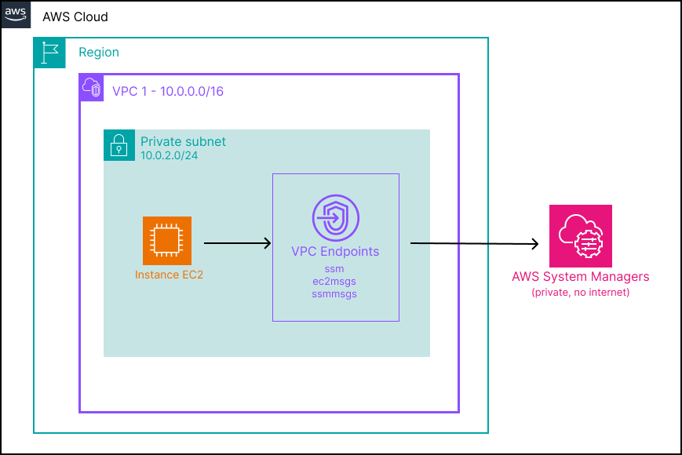

# lab-01-instance-ssm

## Objective

Deploy an EC2 instance correctly — no exposed SSH, no key to manage. Access is handled exclusively via SSM Session Manager. A bastion SSH in 2025 is an anti-pattern.

---

## What this lab deploys

- **1 VPC** — `lab01-vpc` (`10.0.0.0/16`) with a public and private subnet, via `_modules/vpc`
- **1 Security Group** — no inbound from the internet, port 443 open internally for VPC endpoint traffic
- **3 VPC Interface Endpoints** — `ssm`, `ec2messages`, `ssmmessages` — allow the SSM agent to reach AWS services without internet access
- **1 IAM Role + Instance Profile** — with `AmazonSSMManagedInstanceCore` attached, generates temporary STS credentials for the instance
- **1 EC2 instance** — `t3.micro`, Ubuntu 22.04, deployed in the private subnet with the instance profile attached

---

## What you learn

- Why SSM is preferred over SSH — no key to manage, no port exposed, session logs available in CloudWatch
- How IAM, VPC, and Security Groups assemble together on a concrete use case
- Why VPC Interface Endpoints are required when there is no internet access — and what the three SSM endpoints each do
- How temporary credentials work: explore instance metadata from the SSM session with `curl http://169.254.169.254/latest/meta-data/`

---

## Architecture



The instance has no public IP and no inbound port open. The SSM agent communicates exclusively through the three VPC endpoints — traffic never leaves the AWS network.

---

## Structure

```
lab-01-instance-ssm/
├── terraform/
│   ├── main.tf          # VPC module, SG, VPC endpoints, IAM role, EC2 instance
│   ├── variables.tf     # Region
│   ├── outputs.tf       # Instance ID
│   └── providers.tf     # AWS provider (~> 5.0)
└── script/
    └── instance-ssm-terraform.sh    # Init + apply
```

---

## Prerequisites

- [Terraform](https://developer.hashicorp.com/terraform/install) >= 1.0
- AWS CLI configured (`aws configure`)
- [Session Manager plugin](https://docs.aws.amazon.com/systems-manager/latest/userguide/session-manager-working-with-install-plugin.html) installed locally

Install the plugin on Windows:
```bash
winget install Amazon.SessionManagerPlugin
```

IAM permissions required: EC2, VPC, IAM, SSM.

---

## Usage

### Option 1 — Via the script

```bash
chmod +x script/instance-ssm-terraform.sh
./script/instance-ssm-terraform.sh
```

### Option 2 — Manually

```bash
cd terraform/
terraform init
terraform apply
```

---

## Verification

After `terraform apply`, Terraform outputs the instance ID:

```
instance_id = "i-0e27e6ec617e4ec33"
```

### Step 1 — Open a session

```bash
aws ssm start-session --target <instance_id> --region eu-west-3
```

The session may take 30–60 seconds to establish on first connection while the SSM agent registers with the service.

### Step 2 — Explore instance metadata

Once the shell prompt appears, query the instance metadata endpoint:

```bash
# Instance ID
curl http://169.254.169.254/latest/meta-data/instance-id

# Instance type
curl http://169.254.169.254/latest/meta-data/instance-type

# AMI used
curl http://169.254.169.254/latest/meta-data/ami-id

# IAM role attached
curl http://169.254.169.254/latest/meta-data/iam/security-credentials/

# Temporary STS credentials
curl http://169.254.169.254/latest/meta-data/iam/security-credentials/ec2-ssm-role
```

The last call returns the temporary credentials AWS generates for the instance. Note that `AccessKeyId` starts with `ASIA` — the signature of STS temporary credentials — and that they carry an `Expiration` timestamp. AWS renews them automatically before they expire.

---

## Note on the three SSM endpoints

SSM Session Manager requires three VPC Interface Endpoints when the instance has no internet access:

| Endpoint | Role |
|---|---|
| `ssm` | Control channel — agent registration and configuration |
| `ssmmessages` | Data channel — carries the interactive session traffic |
| `ec2messages` | EC2 communication — used by Run Command and agent coordination |

All three must be present. If any is missing, the agent starts but cannot register or open sessions.

---

## Cleanup

```bash
cd terraform/
terraform destroy
```

VPC endpoints take 2–3 minutes to delete — this is normal AWS behaviour.

---

## Cost

**~$0.01** for the EC2 instance if destroyed shortly after testing. The three VPC Interface Endpoints each carry a small hourly charge (~$0.01/h each) — destroy promptly.