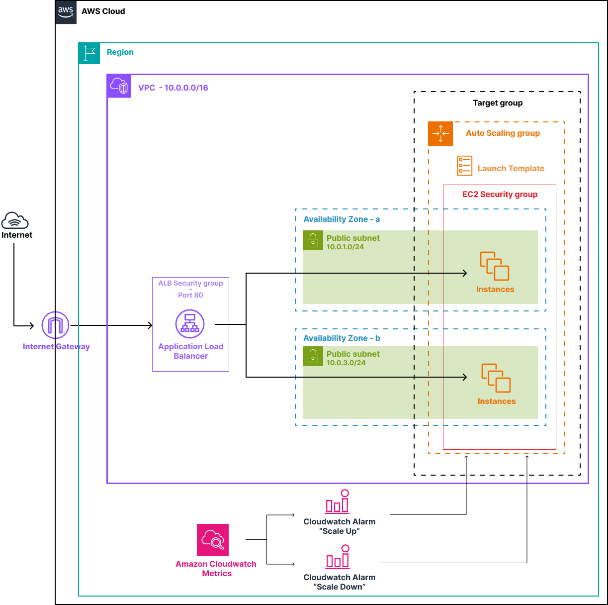

# lab-03-asg

## Objective

Deploy a production-grade auto-scaling architecture on EC2. The infrastructure adapts automatically to load: it replaces unhealthy instances without intervention and scales out when CPU is under pressure, then scales back in when the load drops.

---

## What this lab deploys

- **1 VPC** — `lab03-ec2-asg` (`10.0.0.0/16`) with two public subnets across two AZs (`eu-west-3a` and `eu-west-3b`), via `_modules/vpc`
- **2 Security Groups** — one for the ALB (HTTP open to the world), one for the instances (HTTP from ALB only + SSH from your IP)
- **1 Launch Template** — defines the AMI (Ubuntu 22.04), instance type (t3.micro), Security Group, IAM instance profile, and user data script
- **1 Auto Scaling Group** — min=1 / desired=2 / max=4, spread across both AZs, with ELB health checks
- **1 Application Load Balancer** — distributes incoming HTTP traffic across healthy instances
- **1 Target Group + Listener** — the registry of instances the ALB forwards traffic to
- **2 CloudWatch Alarms** — `cpu-high` (> 70% for 2 min → scale out) and `cpu-low` (< 30% for 2 min → scale in)
- **2 Scaling Policies** — `scale-out` (+1 instance) and `scale-in` (−1 instance), SimpleScaling type
- **1 IAM Role + Instance Profile** — with `AmazonEC2ReadOnlyAccess`, `CloudWatchAgentServerPolicy`, and `AmazonSSMManagedInstanceCore`

---

## What you learn

- The difference between Launch Configuration (deprecated) and Launch Template
- What min / desired / max each guarantee and how the ASG uses them
- How the ASG and ALB coordinate through the Target Group — instances register and deregister automatically
- How ELB health checks trigger automatic instance replacement
- Why an ALB requires at least two subnets in different AZs
- Why instance Security Groups should only accept traffic from the ALB SG, not from `0.0.0.0/0`
- How CloudWatch Alarms trigger scaling policies — the two-period evaluation window prevents reacting to transient spikes
- The difference between SimpleScaling (fixed step, manual thresholds) and TargetTrackingScaling (proportional, AWS-managed alarms)
- How to observe scaling events in real time from the console and CLI

---

## Architecture



Internet traffic hits the ALB, which forwards requests to healthy instances registered in the Target Group. The ASG maintains the desired number of instances across two AZs and reacts to CloudWatch alarms to scale out or in. Instances are never directly reachable from the internet — only the ALB can reach them on port 80.

---

## Structure

```
lab-03-asg/
├── terraform/
│   ├── main.tf          # VPC module, SGs, IAM, Launch Template, ALB, ASG, alarms
│   ├── variables.tf     # Region, my_ip, instance_type
│   ├── outputs.tf       # ALB DNS, ASG name, useful CLI commands
│   ├── providers.tf     # AWS provider (~> 5.0)
│   └── terraform.tfvars # Your public IP
└── script/
    ├── asg-nginx.sh          # User data — installs Nginx + stress at boot
    ├── asg-terraform.sh      # Init + apply shortcut
    └── stress-test.sh        # CPU stress via SSM → observes scale-out and scale-in
```

---

## Prerequisites

- [Terraform](https://developer.hashicorp.com/terraform/install) >= 1.0
- AWS CLI configured (`aws configure`)
- Your public IP: `curl -4 ifconfig.me`

IAM permissions required: EC2, VPC, IAM, AutoScaling, ElasticLoadBalancing, CloudWatch, SSM.

---

## Usage

### Step 1 — Set your IP

```bash
# terraform/terraform.tfvars
my_ip = "X.X.X.X/32"
```

### Step 2 — Deploy

```bash
cd terraform/
terraform init
terraform apply
```

The apply takes 3–4 minutes. The ALB is the slowest resource to provision.

### Step 3 — Run the stress test

```bash
bash script/stress-test.sh
```

The script waits for SSM to be ready, sends `stress --cpu 2` to all InService instances, then monitors scale-out and scale-in automatically.

---

## Verification

### Test the ALB

```bash
# From terraform outputs after apply
curl http://<alb_dns_name>

# Run several times — you should see different hostnames
for i in $(seq 1 10); do curl -s http://<alb_dns_name>; sleep 1; done
```

### Watch the ASG in real time

```bash
watch -n 5 'aws autoscaling describe-auto-scaling-groups \
  --auto-scaling-group-names lab03-asg \
  --region eu-west-3 \
  --query "AutoScalingGroups[0].Instances[*].{ID:InstanceId,AZ:AvailabilityZone,State:LifecycleState,Health:HealthStatus}" \
  --output table'
```

### Console checkpoints (in order)

| Where | What to verify |
|---|---|
| VPC → Subnets | Two public subnets in `eu-west-3a` and `eu-west-3b` |
| EC2 → Launch Templates | AMI, t3.micro, correct SG, user data present |
| EC2 → Auto Scaling Groups → Activity | Launch events at startup, scaling events during stress test |
| EC2 → Auto Scaling Groups → Instance management | Instances transition to `InService` / `Healthy` |
| EC2 → Target Groups → lab03-tg → Targets | Both instances `healthy` before running the stress test |
| CloudWatch → Alarms | `lab03-cpu-high` and `lab03-cpu-low` visible — `OK` at rest |

---

## Expected scaling behaviour

| Phase | CPU | Alarm | Action |
|---|---|---|---|
| Idle (after deploy) | ~2% | `cpu-low` → ALARM | Scale in: 2 → 1 instance |
| Stress test running | ~100% | `cpu-high` → ALARM | Scale out: 1 → 2 instances |
| Stress test done | ~2% | `cpu-low` → ALARM | Scale in: 2 → 1 instance |

Scale-in takes longer (~7–8 min) due to the 300s cooldown + two 60s evaluation periods.

---

## Cleanup

```bash
cd terraform/
terraform destroy
```

Check in the console that EC2 instances, the ALB, the Target Group, and CloudWatch alarms have all been removed.

---

## Cost

~$0.02–0.05 for a full lab session if destroyed promptly. The ALB carries a small fixed hourly charge (~$0.008/h) — the main reason to destroy after the lab.

| Resource | Cost |
|---|---|
| t3.micro × 1–4 | ~$0.011/h per instance |
| ALB | ~$0.008/h |
| CloudWatch alarms × 2 | ~$0.10/alarm/month |

---

## Going further — TargetTrackingScaling

The `terraform-tts/` folder contains an alternative version of the scaling
configuration using `TargetTrackingScaling` instead of `SimpleScaling`.

Instead of manually defining two thresholds (scale out > 70%, scale in < 30%)
and wiring them to CloudWatch alarms, you declare a single target:

```hcl
target_tracking_configuration {
  predefined_metric_specification {
    predefined_metric_type = "ASGAverageCPUUtilization"
  }
  target_value = 50
}
```

AWS calculates how many instances to add or remove to converge toward 50% CPU,
and creates the CloudWatch alarms automatically.

| | SimpleScaling | TargetTrackingScaling |
|---|---|---|
| Terraform resources | 4 (2 policies + 2 alarms) | 1 |
| Step size | Fixed (+1 / −1) | Proportional |
| Alarms | Manual | AWS-managed |
| Recommended for new infra | No | Yes |

To apply the TargetTracking version, copy the three files into `terraform/`,
replacing the existing scaling blocks at the bottom of `main.tf`.