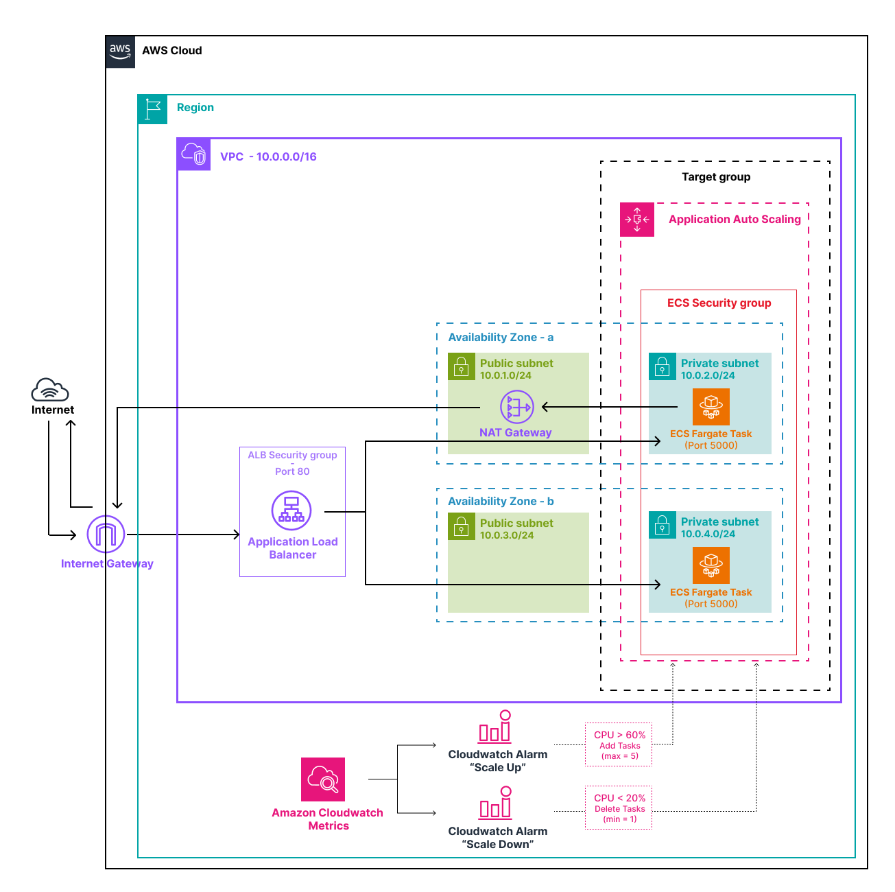

# lab-02 — Fargate + ALB + Auto Scaling

> Build a production-like container architecture with load balancing, private networking, and auto scaling.  
> The closest lab to a real deployment in this series.

---

## What This Lab Covers

- **1 VPC** — with public subnets (ALB) and private subnets (ECS tasks) across 2 AZs
- **1 Application Load Balancer** — internet-facing, HTTP :80, deployed in public subnets
- **1 Target Group** — type `ip` (required for Fargate), health check on `GET /`, auto-managed by ECS
- **1 ECS Service** — 2 desired tasks, deployed in private subnets, no public IP
- **2 Security Groups** — chained: ALB accepts :80 from internet; tasks accept :5000 from ALB SG only
- **Application Auto Scaling** — scale out if CPU > 60%, scale in if CPU < 20%, min=1 / desired=2 / max=5
- **1 NAT Gateway** — required so private tasks can pull images from ECR and write logs to CloudWatch

---

## What You Learn

- **Why tasks run in private subnets** — the ALB is the sole public entry point; tasks are never directly reachable from the internet, even if you know their private IP
- **Chained security groups** — the task SG allows inbound only from the ALB SG, not from a CIDR range; adding a new AZ or IP requires no rule change
- **`target_type = "ip"`** — Fargate has no instance IDs; ECS registers task IPs directly in the Target Group and removes them automatically on scale-in or task replacement
- **Rolling updates** — when you push a new image, ECS starts new tasks, waits for health checks to pass, then stops old ones; `minimum_healthy_percent` and `maximum_percent` control the pace
- **Auto scaling mechanics** — CloudWatch alarms watch ECS CPU metrics; step scaling adds or removes tasks when thresholds are breached for a sustained period
- **NAT Gateway role** — private tasks have no public IP, so outbound internet traffic (ECR pull, CloudWatch logs) routes through the NAT Gateway in the public subnet

---

## Architecture



---

## Structure

```
lab-02-fargate-alb/
├── README.md
├── .gitignore
├── app/
│   ├── app.py               # Flask app — returns hostname + lab name as JSON
│   ├── Dockerfile
│   └── requirements.txt
├── scripts/
│   ├── deploy.sh            # Build → ECR push → ECS rolling update → wait stable
│   ├── load_test.sh         # N parallel curl workers to push CPU above threshold
│   └── observe.sh           # Watch ALB responses and task counts in real time
└── terraform/
    ├── main.tf              # VPC module call
    ├── alb.tf               # ALB, Target Group, Listener
    ├── ecs.tf               # Cluster, Task Definition, Service
    ├── autoscaling.tf       # AppAutoScaling target + step scaling policies
    ├── cloudwatch.tf        # Log group + CPU alarms (scale out / scale in)
    ├── ecr.tf               # ECR repository
    ├── iam.tf               # ECS execution role
    ├── security_groups.tf   # ALB SG + ECS tasks SG (chained)
    ├── providers.tf
    ├── variables.tf
    └── outputs.tf
```

---

## Prerequisites

- Terraform >= 1.6
- AWS CLI configured (`aws configure`)
- Docker with `linux/amd64` build support (mandatory on Mac M1/M2/M3)
- IAM permissions: `ecs:*`, `ecr:*`, `elasticloadbalancing:*`, `ec2:*`, `iam:*`, `cloudwatch:*`, `application-autoscaling:*`

---

## Full Lab Walkthrough

### Step 1 — Deploy the infrastructure

```bash
cd terraform/
terraform init
terraform plan
terraform apply
```

> ⏱ ~3-4 min — the NAT Gateway is the slowest resource to provision.

Note the outputs printed at the end:
```
alb_dns_name       = "http://lab02-alb-xxxxx.eu-west-3.elb.amazonaws.com"
ecr_repository_url = "123456789.dkr.ecr.eu-west-3.amazonaws.com/lab02-app"
ecs_cluster_name   = "lab02-cluster"
ecs_service_name   = "lab02-service"
```

**Console checks before moving on:**
- **VPC → Subnets** — 2 public subnets (AZ-a, AZ-b) and 2 private subnets visible
- **EC2 → Load Balancers** — `lab02-alb` is in *active* state
- **ECS → Clusters → lab02-cluster → Services** — service exists but shows 0 running tasks — expected, the image has not been pushed yet

---

### Step 2 — Build and deploy the application

```bash
cd ..   # back to lab-02-fargate-alb/
chmod +x scripts/*.sh
./scripts/deploy.sh
```

The script: authenticates with ECR → builds the image (`--platform linux/amd64`) → pushes → forces a rolling update → waits for the service to stabilize.

> ⏱ ~3-5 min on first deploy (Fargate pulls the image from ECR on task start).

**Console checks:**
- **ECS → Service → Tasks** — 2 tasks in *Running* state
- **EC2 → Target Groups → lab02-tg → Targets** — 2 targets *healthy*, both with private IPs (10.0.x.x)

---

### Step 3 — Test load balancing

```bash
ALB=$(cd terraform && terraform output -raw alb_dns_name)

# Single request
curl $ALB

# Loop — watch the hostname alternate between tasks
for i in $(seq 1 6); do curl -s $ALB; echo ""; done
```

Expected output — `hostname` alternates between the two tasks:
```json
{"hostname": "ip-10-0-2-45", "lab": "lab-02-fargate-alb", "message": "Hello from Fargate!"}
{"hostname": "ip-10-0-4-12", "lab": "lab-02-fargate-alb", "message": "Hello from Fargate!"}
{"hostname": "ip-10-0-2-45", ...}
```

---

### Step 4 — Observe auto scaling

Open two terminals.

**Terminal 1:**
```bash
./scripts/observe.sh
```

**Terminal 2:**
```bash
./scripts/load_test.sh          # 10 workers, 3 min (default)
./scripts/load_test.sh 20 300   # if scaling does not trigger
```

What to expect:

| Delay | What happens |
|-------|-------------|
| 0–2 min | Traffic running, CPU rising |
| ~2 min | CloudWatch alarm `cpu-high` fires |
| ~2–3 min | `desired` increases from 2 to 3 in observe.sh |
| ~4–5 min | 3rd task is *running*, its hostname appears in observe.sh |
| After load test | CPU drops, `cpu-low` alarm fires after ~3 min |
| ~3–5 min later | `desired` drops back to 2 — scale-in complete |

**Console checks during load test:**
- **CloudWatch → Alarms** — watch `lab02-cpu-high` transition to *In alarm*
- **ECS → Service → Events** — scaling decisions are logged here in plain text

---

### Step 5 — Rolling update (bonus)

Edit `app/app.py` — change the message:
```python
"message": "Hello from Fargate v2!",
```

Redeploy:
```bash
./scripts/deploy.sh
```

Run `observe.sh` in parallel. For ~1-2 minutes you will see both v1 and v2 hostnames responding — old and new tasks coexist during the transition. Then only v2 remains. Zero downtime.

This is controlled by two parameters in `ecs.tf`:
- `deployment_minimum_healthy_percent = 50` — never fewer than 1 task running
- `deployment_maximum_percent = 200` — can run extra tasks during the transition

---

### Step 6 — Cleanup

**Required first — ECR must be emptied before `terraform destroy`:**

```bash
aws ecr batch-delete-image \
  --repository-name lab02-app \
  --image-ids imageTag=latest \
  --region eu-west-3
```

**Then destroy:**
```bash
cd terraform/
terraform destroy
```

> ⏱ ~4-5 min.

**Console checks after cleanup:**
- **ECS** — no cluster named `lab02`
- **EC2 → Load Balancers** — `lab02-alb` is gone
- **VPC** — `lab02-vpc` is gone, and crucially the NAT Gateway is gone (main cost driver)
- **ECR** — `lab02-app` repository is gone

---

## Key Concepts

### Private subnets and the ALB

Tasks have no public IP and sit in private subnets. The ALB is the only way in. This mirrors standard EC2 architecture — the load balancer is the single public entry point, and backend resources are never directly exposed.

The security group chain enforces this at the network level: the task SG allows inbound only `from_security_group = alb_sg_id`, not from any CIDR block. Even if you knew a task's private IP, you could not reach it from outside the VPC.

### Service discovery — how ECS manages the Target Group

You never manually register or deregister targets. When ECS starts a task, it registers the task's private IP in the Target Group. When a task stops (scale-in, rolling update, crash), ECS deregisters it. The ALB health check then stops routing to it.

`deregistration_delay = 30` in the Target Group speeds this up for the lab — the default is 300 seconds.

### Auto scaling: step scaling vs target tracking

This lab uses **step scaling** — you define thresholds and fixed adjustments (+1 task above 60% CPU, -1 task below 20% CPU).

An alternative is **target tracking** — you define a target value (e.g. keep CPU at 50%) and AWS adjusts capacity automatically. Target tracking is simpler to configure but gives you less control over the scaling behavior.

### NAT Gateway cost

The NAT Gateway (~$0.045/h) is the most expensive resource in this lab — more than the Fargate tasks themselves. It exists solely because private tasks need outbound internet access to pull images from ECR and write logs to CloudWatch.

An alternative for ECR and CloudWatch specifically is **VPC endpoints** — private connections that route traffic within the AWS network without a NAT Gateway. More complex to set up, but eliminates this cost in production.

---

## Verification Checklist

| Where | What to verify |
|-------|---------------|
| VPC → Subnets | 2 public (AZ-a, AZ-b) + 2 private (AZ-a, AZ-b) |
| EC2 → Load Balancers | `lab02-alb` active, listener on :80 |
| EC2 → Target Groups → Targets | 2 targets healthy, private IPs only |
| ECS → Service → Tasks | 2 tasks running, no public IP assigned |
| curl loop on ALB URL | hostname alternates between tasks |
| CloudWatch → Alarms | `lab02-cpu-high` and `lab02-cpu-low` visible |
| observe.sh during load test | desiredCount increases from 2 to 3+ |
| After cleanup | no ECS cluster, no ALB, no VPC, no NAT Gateway |

---

## Cost

| Resource | Cost/hour |
|----------|-----------|
| ALB | ~$0.008 |
| 2 Fargate tasks (0.25 vCPU, 512 MB) | ~$0.020 |
| NAT Gateway | ~$0.045 + $0.045/GB transferred |
| **Total** | **~$0.07/h** (~$1.70/24h) |

**Destroy as soon as you are done with the lab.**