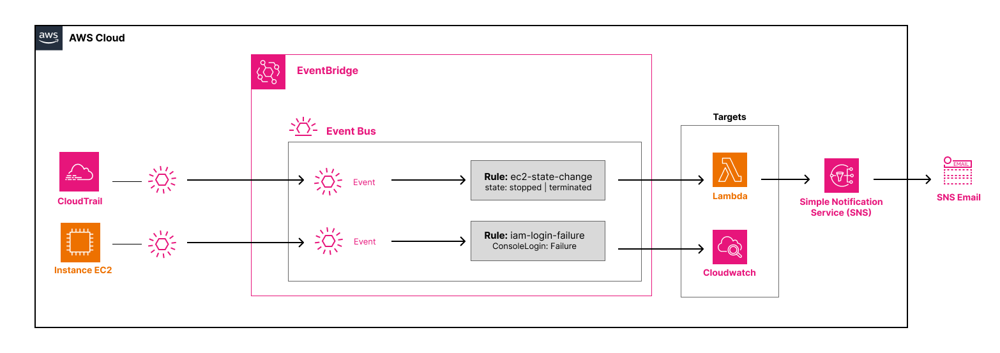

# lab-02-event-driven

## Objective

Understand EventBridge in its most powerful use case — reacting to real AWS events in real time.
Two EventBridge rules listen on the default event bus and trigger targets automatically: one forwards EC2 state changes to a Lambda that sends an SNS email alert, the other archives IAM console login failures directly to CloudWatch Logs. No polling, no server, no manual trigger.

---

## What this lab deploys

- **1 EC2 Instance** — `lab-02-event-driven`, Ubuntu 22.04 t3.micro, used as the manual trigger for the pipeline
- **1 Lambda Function** — `lab-02-event-driven`, receives the EC2 event, extracts instance ID and state, publishes a formatted alert to SNS
- **1 IAM Role** — least-privilege: CloudWatch Logs write, SNS publish
- **1 SNS Topic** — `lab-02-event-driven-sns-topic`, receives the Lambda output and delivers it by email
- **1 SNS Email Subscription** — forwards alerts to the configured address (requires manual confirmation)
- **2 EventBridge Rules** — `ec2-state-change` (stopped/terminated → Lambda) and `iam-login-failure` (ConsoleLogin Failure → CloudWatch Logs)
- **1 Lambda Resource Policy** — allows EventBridge to invoke the Lambda function
- **2 CloudWatch Log Groups** — `/aws/lambda/lab-02-event-driven` (Lambda logs, 7-day retention) and `/aws/events/security-alerts` (raw IAM events, 7-day retention)

---

## What you learn

- **EventBridge event patterns** — filtering by `source`, `detail-type`, and nested fields inside `detail`; EventBridge filters events *before* invoking the target, eliminating unnecessary Lambda invocations
- **The default event bus** — AWS automatically publishes events from all its services to this bus with zero configuration on your part; you only write rules to intercept them
- **Default bus vs custom bus** — the default bus carries native AWS events (EC2, IAM, S3…); a custom bus carries application events you publish yourself with `PutEvents` — the foundation of microservices event-driven architectures
- **Retry policy on EventBridge targets** — if Lambda fails, EventBridge automatically retries with exponential backoff up to the configured limit
- **Reactive security with EventBridge + CloudTrail** — detecting and responding automatically to sensitive actions in real time, without polling or agents
- **Permissions in two directions** — the IAM Role allows Lambda to write logs and publish to SNS; the Resource Policy allows EventBridge to invoke Lambda; both layers are required

---

## Architecture



EC2 Instance ── stop/terminate ──► Default Event Bus

IAM Console login failure ──────► Default Event Bus (via CloudTrail)

---

## Structure

```
lab-02-event-driven/
├── README.md
├── .gitignore
├── docs/
│   └── diagram-event-driven.png         # Architecture diagram
├── script/
│   ├── handler.py                        # Lambda function — extracts EC2 event, publishes to SNS
│   └── event-driven-terraform.sh         # terraform init + apply shortcut
└── terraform/
    ├── cloudwatch.tf                     # CloudWatch Log Groups + EventBridge Rules + Targets
    ├── ec2.tf                            # EC2 test instance
    ├── iam.tf                            # Lambda execution role, SNS publish policy
    ├── lambda.tf                         # Lambda function, packaging, resource policy
    ├── main.tf                           # account_id and region data sources
    ├── outputs.tf                        # Resource names, ARNs, console deep links
    ├── providers.tf                      # AWS provider (~> 5.0), archive provider
    ├── sns.tf                            # SNS topic and email subscription
    ├── terraform.tfvars                  # Your email address (git-ignored)
    ├── terraform.tfvars.example          # Committed template
    └── variables.tf                      # region, project_name, email_address, log_retention_days
```

---

## Prerequisites

- [Terraform](https://developer.hashicorp.com/terraform/install) >= 1.6
- AWS CLI configured (`aws configure`)
- An AWS account with CloudTrail active (required for the IAM login pattern — enabled by default on recent accounts)
- Permissions: `lambda:*`, `ec2:*`, `iam:*`, `logs:*`, `events:*`, `sns:*`

---

## Usage

### Step 1 — Configure

```bash
cp terraform/terraform.tfvars.example terraform/terraform.tfvars
# Edit terraform.tfvars — set email_address to your real address
```

### Step 2 — Deploy

```bash
bash script/event-driven-terraform.sh
```

Note the outputs — they contain the EC2 instance ID and a direct console link.

**Important:** after apply, AWS sends a confirmation email for the SNS subscription.
**You must click "Confirm subscription"** before any alert reaches your inbox.

### Step 3 — Explore the console before testing

Take a few minutes to review what Terraform just created. This is where the learning happens.

**EventBridge → Rules:** confirm both rules are present and `ENABLED`. Click `ec2-state-change` and read the event pattern JSON. Open the **Targets** tab — the Lambda is listed. Notice the retry policy.

**Lambda → Functions → lab-02-event-driven:** check **Configuration → Environment variables** (`SNS_TOPIC_ARN` is injected). Open **Configuration → Permissions → Resource-based policy** — confirm the `AllowExecutionFromEventBridge` statement is there. Without it, EventBridge would receive a silent `Access Denied`.

**SNS → Topics → lab-02-event-driven-sns-topic:** confirm the subscription status is `Confirmed`, not `PendingConfirmation`.

### Step 4 — Trigger the EC2 pipeline

```bash
INSTANCE_ID=$(cd terraform && terraform output -raw test_instance_id)

# Stop the instance
aws ec2 stop-instances --instance-ids $INSTANCE_ID --region eu-west-3

# Tail Lambda logs in real time
aws logs tail /aws/lambda/lab-02-event-driven --follow --region eu-west-3
```

Within 30 seconds you should see the raw event printed by the Lambda, followed by the SNS confirmation. Check your inbox — the alert email should arrive shortly after.

Restart the instance to test again:

```bash
aws ec2 start-instances --instance-ids $INSTANCE_ID --region eu-west-3
```

Note: the `pending` → `running` transition does not match the event pattern filter (`stopped`, `terminated`), so Lambda is not invoked. This illustrates exactly how EventBridge filtering works.

### Step 5 — Trigger the IAM security pipeline

Open a private browsing window, go to `console.aws.amazon.com`, and enter your account ID with a wrong password. Wait 2–5 minutes for CloudTrail to ingest the event, then:

```bash
aws logs tail /aws/events/security-alerts --follow --region eu-west-3
```

You should see the raw JSON event from the failed login archived in the log group.

### Step 6 — Cleanup

```bash
# Terminate the EC2 instance first
aws ec2 terminate-instances --instance-ids $INSTANCE_ID --region eu-west-3

# Wait until terminated
aws ec2 wait instance-terminated --instance-ids $INSTANCE_ID --region eu-west-3

# Destroy all infrastructure
cd terraform && terraform destroy
```

Terminate the instance before running `destroy` — it prevents Terraform from failing on resource deletion ordering.

---

## Verification

| Where | What to verify |
|---|---|
| EventBridge → Rules | Both rules present and `ENABLED` |
| EventBridge → Rule `ec2-state-change` → Targets | Lambda listed as target |
| EventBridge → Rule `iam-login-failure` → Targets | CloudWatch Log Group listed as target |
| Lambda → Configuration → Triggers | EventBridge listed as trigger source |
| Lambda → Configuration → Permissions → Resource policy | `AllowExecutionFromEventBridge` statement present |
| SNS → Topics → Subscriptions | Status is `Confirmed` (not `PendingConfirmation`) |
| CloudWatch → Log groups | `/aws/lambda/lab-02-event-driven` and `/aws/events/security-alerts` present |
| CloudWatch → Logs (Lambda) | Raw event JSON and SNS confirmation visible after EC2 stop |
| CloudWatch → Logs (security) | Raw IAM login event visible after failed console login |
| Email inbox | Alert received with instance ID, state, and region |

---

## Key concepts

### EventBridge event pattern

EventBridge filters events **before** invoking the target. A non-matching event costs nothing and does not invoke Lambda.

```json
{
  "source": ["aws.ec2"],
  "detail-type": ["EC2 Instance State-change Notification"],
  "detail": {
    "state": ["stopped", "terminated"]
  }
}
```

Patterns support advanced operators: `prefix`, `anything-but`, `numeric`, `exists`, `ip-address`. Filtering at the bus level is always cheaper than filtering inside Lambda.

### The default event bus

AWS automatically publishes events from every service — EC2, S3, RDS, IAM, CodePipeline — to the default event bus. No configuration is needed on the source side. You only write rules to intercept the events you care about.

### Default bus vs custom bus

| Default event bus | Custom event bus |
|---|---|
| Native AWS events (EC2, IAM, S3…) | Application events you publish yourself |
| Zero source configuration | Explicit `PutEvents` call in your code |
| Examples: state-change, CloudTrail, Config | Examples: `order.placed`, `user.registered` |

A custom event bus is the foundation of microservices event-driven architectures — each service publishes its own events; others subscribe via rules without knowing about each other.

### Retry policy on EventBridge targets

When Lambda fails (timeout, unhandled exception), EventBridge retries automatically:

- Exponential backoff between attempts
- `maximum_retry_attempts`: max number of retries (3 in this lab)
- `maximum_event_age_in_seconds`: how long to keep retrying (1 hour in this lab)
- After all retries are exhausted: event is dropped (or sent to a Dead Letter Queue if configured)

### Reactive security with EventBridge + CloudTrail

CloudTrail publishes API and sign-in events to the default event bus. EventBridge rules can intercept them in near-real time — no polling, no agent, no fixed cost. This pattern extends naturally to: IAM policy changes, S3 public access modifications, root account usage, and any other CloudTrail-recorded action.

### Permissions in two directions

Two distinct permission layers are required and easy to confuse:

| Resource | Direction | Allows |
|---|---|---|
| IAM Role (`iam.tf`) | Lambda → CloudWatch / SNS | Lambda can write logs and publish alerts |
| Lambda Resource Policy (`lambda.tf`) | EventBridge → Lambda | EventBridge is allowed to invoke the function |

Without the Resource Policy, EventBridge receives a silent `Access Denied`. No error appears in EventBridge — the rule fires, the invocation is attempted, and nothing happens. This is one of the most common and hardest-to-debug misconfigurations in event-driven architectures.

---

## Cleanup

```bash
cd terraform/
terraform destroy
```

Verify in the console that the EventBridge rules, Lambda function, SNS topic, EC2 instance, and CloudWatch log groups are all gone.

---

## Cost

Near $0 — this lab runs almost entirely within the AWS free tier.

| Resource | Free tier |
|---|---|
| EventBridge Rules | 1,000,000 invocations / month free |
| Lambda | 1,000,000 invocations / month free |
| SNS | 1,000 email deliveries / month free |
| CloudWatch Logs | 5 GB ingestion / month free |
| EC2 t3.micro | ~$0.01/h — a few cents for the duration of the test |