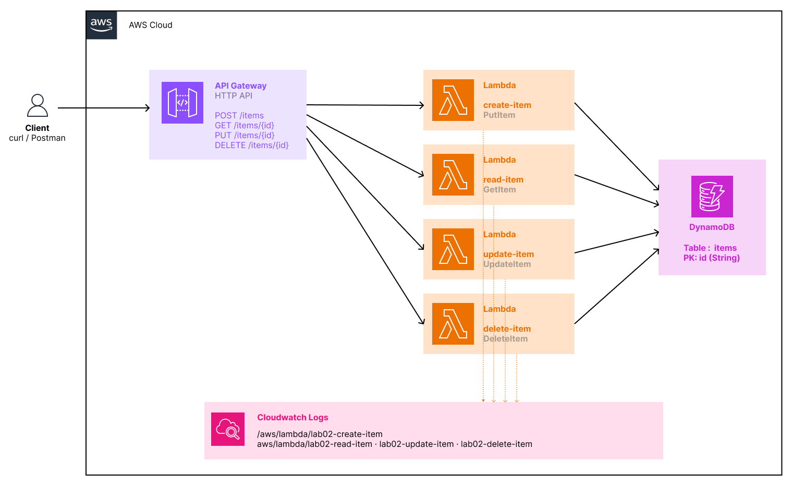

# lab-02-api-rest

## Objective

Build a complete serverless REST API from scratch — the most ambitious and resume-worthy Lambda lab.
This lab combines three AWS services into a coherent architecture: API Gateway routes incoming HTTP requests to the right Lambda function, which reads or writes data in DynamoDB.
No server running permanently, no framework — just four focused functions, each responsible for one operation.

---

## What this lab deploys

- **1 DynamoDB Table** — `items`, with `id` (String) as partition key, PAY_PER_REQUEST billing
- **4 Lambda Functions** — one per CRUD operation: `lab02-create-item`, `lab02-read-item`, `lab02-update-item`, `lab02-delete-item`
- **4 IAM Roles** — one per Lambda, each with a least-privilege policy granting only the required DynamoDB action on only this table
- **1 API Gateway HTTP API** — `main-api`, with four routes wired to their corresponding Lambda
- **4 Lambda Permissions** — allow API Gateway to invoke each function
- **CloudWatch Log Groups** — one per Lambda, auto-created on first invocation

---

## What you learn

- **HTTP API vs REST API** — API Gateway offers two flavours; HTTP API is newer, ~70% cheaper, lower latency, and sufficient for the vast majority of use cases
- **Lambda proxy integration** — API Gateway passes the full HTTP request to Lambda inside the `event` object; Lambda must return a structured response with `statusCode`, `headers`, and `body`
- **DynamoDB data model** — partition key, schema-less items, no AUTO_INCREMENT; IDs must be generated by the application (`uuid.uuid4()`)
- **DynamoDB vs SQL** — `GetItem` returns `None` (not an exception) when an item doesn't exist; `DeleteItem` and `UpdateItem` succeed silently on non-existent items unless a `ConditionExpression` is set
- **Dynamic `UpdateExpression`** — DynamoDB has no `UPDATE SET col = val` syntax; the expression must be built programmatically with aliased attribute names to avoid conflicts with reserved words
- **Decimal serialization** — boto3 returns all numbers from DynamoDB as `Decimal`; `json.dumps()` cannot serialize this type natively and requires a custom conversion step
- **Environment variables** — the DynamoDB table name is passed to each Lambda via an environment variable set by Terraform, never hardcoded in the function code
- **Least-privilege IAM** — each Lambda has its own role with exactly one DynamoDB action allowed; `create` can only `PutItem`, `read` can only `GetItem`, and so on

---

## Architecture





Each Lambda has its own IAM Role. The `TABLE_NAME` environment variable is injected by Terraform at deploy time.

---

## Structure

```
lab-02-api-rest/
├── README.md
├── script/
│   ├── create_item.py              # Lambda — POST /items
│   ├── read_item.py                # Lambda — GET /items/{id}
│   ├── update_item.py              # Lambda — PUT /items/{id}
│   ├── delete_item.py              # Lambda — DELETE /items/{id}
│   └── api-rest-terraform.sh       # terraform init + apply shortcut
└── terraform/
    ├── api_gateway.tf              # HTTP API, stage, integrations, routes
    ├── dynamodb.tf                 # DynamoDB table — PAY_PER_REQUEST, PK: id
    ├── iam.tf                      # 4 roles, 4 least-privilege policies, CloudWatch attachment
    ├── lambda.tf                   # 4 functions, zip packaging, Lambda permissions
    ├── locals.tf                   # Centralized config — action, file, route per Lambda
    ├── outputs.tf                  # API URL, table name, ready-to-use curl commands
    ├── providers.tf                # AWS provider (~> 5.0), archive provider
    └── variables.tf                # region, lab-name, table_name
```

---

## Prerequisites

- [Terraform](https://developer.hashicorp.com/terraform/install) >= 1.3
- AWS CLI configured (`aws configure`)
- Permissions: `lambda:*`, `apigateway:*`, `dynamodb:*`, `iam:*`, `logs:*`

---

## Usage

### Step 1 — Deploy

```bash
bash script/api-rest-terraform.sh
```

Terraform creates all resources in ~30 seconds. Copy the `api_url` from the outputs:

```bash
export API_URL="https://xxxxxxxxxx.execute-api.eu-west-3.amazonaws.com"
```

### Step 2 — Verify in the AWS console

| Service | What to check |
|---|---|
| DynamoDB → Tables | `items` present, billing mode `PAY_PER_REQUEST` |
| Lambda → Functions | 4 functions with prefix `lab02-` |
| Lambda → Configuration → Environment variables | `TABLE_NAME = items` on each function |
| Lambda → Configuration → Permissions | One IAM role per function, one DynamoDB action each |
| API Gateway → main-api → Routes | 4 routes, each integrated with the correct Lambda |
| IAM → Roles | 4 roles with prefix `lab02-`, each with a single-action inline policy |

### Step 3 — Test the happy path

```bash
# CREATE — insert a new item (note the generated id in the response)
curl -s -X POST $API_URL/items \
  -H "Content-Type: application/json" \
  -d '{"name": "Laptop", "price": 999, "stock": 10}' | python3 -m json.tool

export ITEM_ID="<id returned above>"

# READ — retrieve the item by id
curl -s $API_URL/items/$ITEM_ID | python3 -m json.tool

# UPDATE — modify only the provided attributes; others are preserved
curl -s -X PUT $API_URL/items/$ITEM_ID \
  -H "Content-Type: application/json" \
  -d '{"price": 799, "stock": 5}' | python3 -m json.tool

# DELETE — remove the item
curl -s -X DELETE $API_URL/items/$ITEM_ID | python3 -m json.tool
```

### Step 4 — Test the error cases

```bash
# READ on a non-existent id — must return 404
curl -s -o /dev/null -w "%{http_code}" $API_URL/items/does-not-exist

# DELETE on a non-existent id — must return 404
curl -s -X DELETE $API_URL/items/does-not-exist | python3 -m json.tool

# CREATE with empty body — must return 400
curl -s -X POST $API_URL/items \
  -H "Content-Type: application/json" \
  -d '{}' | python3 -m json.tool

# CREATE with malformed JSON — must return 400
curl -s -X POST $API_URL/items \
  -H "Content-Type: application/json" \
  -d 'not json' | python3 -m json.tool
```

### Step 5 — Check the logs

If an invocation returns an unexpected result, inspect the CloudWatch logs:

```bash
aws logs tail /aws/lambda/lab02-create-item --follow --region eu-west-3
```

Or in the console: **CloudWatch → Log groups → `/aws/lambda/lab02-<function>`**.

---

## Key concepts

### Lambda proxy integration

API Gateway does not transform the HTTP request — it forwards it as-is inside the Lambda `event` object:

```json
{
  "requestContext": { "http": { "method": "PUT" } },
  "pathParameters": { "id": "550e8400-e29b-41d4-a716-446655440000" },
  "headers": { "content-type": "application/json" },
  "body": "{\"price\": 799}"
}
```

Lambda must return a structured object — API Gateway will not accept a plain string or dict:

```json
{
  "statusCode": 200,
  "headers": { "Content-Type": "application/json" },
  "body": "{\"id\": \"550e8400...\", \"price\": 799}"
}
```

The `body` field **must** be a JSON string (`json.dumps(...)`), not a Python dict. Returning a dict directly causes a 502 error.

### DynamoDB and the absence of exceptions

DynamoDB does not raise exceptions when an item is missing — it simply returns a dict without the `Item` key:

```python
result = table.get_item(Key={"id": item_id})
item = result.get("Item")   # None if not found — not an exception
```

For write operations (`update_item`, `delete_item`), the default behaviour is to succeed silently even on non-existent items. A `ConditionExpression` forces a `ConditionalCheckFailedException`, which is how a genuine 404 is returned:

```python
table.delete_item(
    Key={"id": item_id},
    ConditionExpression="attribute_exists(id)"   # raises if item does not exist
)
```

### Dynamic UpdateExpression

DynamoDB has no SQL `UPDATE SET col = val` syntax. The expression is built at runtime from the request body:

```python
for i, (key, value) in enumerate(body.items()):
    expr_names[f"#n{i}"] = key    # aliases avoid conflicts with DynamoDB reserved words
    expr_values[f":v{i}"] = value

update_expression = "SET " + ", ".join(f"#n{i} = :v{i}" for i in range(len(body)))
```

Attribute name aliases (e.g. `#n0`) are required because many common field names — `name`, `status`, `data`, `type` — are reserved words in DynamoDB and cannot be used directly in expressions.

### The Decimal serialization issue

boto3 stores all numeric values in DynamoDB as Python `Decimal` objects to avoid IEEE 754 floating-point precision loss. `json.dumps()` cannot serialize `Decimal` natively:

```
TypeError: Object of type Decimal is not JSON serializable
```

The fix is a recursive conversion before serialization:

```python
def decimal_to_native(obj):
    if isinstance(obj, list):
        return [decimal_to_native(i) for i in obj]
    elif isinstance(obj, dict):
        return {k: decimal_to_native(v) for k, v in obj.items()}
    elif isinstance(obj, Decimal):
        return int(obj) if obj % 1 == 0 else float(obj)
    return obj
```

This only affects functions that **read** from DynamoDB (`read_item`, `update_item` with `ReturnValues`). The `create_item` function is not affected because it inserts values that come directly from the JSON body, which are already native Python types.

### Least-privilege IAM with `for_each`

Rather than one shared role for all Lambdas, each function has its own role with exactly one allowed action:

```hcl
locals {
  lambdas = {
    create = { action = "dynamodb:PutItem",    ... }
    read   = { action = "dynamodb:GetItem",    ... }
    update = { action = "dynamodb:UpdateItem", ... }
    delete = { action = "dynamodb:DeleteItem", ... }
  }
}
```

`for_each` on this map generates all four roles, policies, and attachments from a single resource block each — no duplication, and the config for each Lambda lives in one place.

---

## Cleanup

```bash
cd terraform/
terraform destroy
```

Verify in the console that the DynamoDB table, Lambda functions, and API Gateway are gone.

---

## Cost

$0 — this lab runs entirely within the AWS free tier.

| Resource | Free tier |
|---|---|
| DynamoDB storage | 25 GB permanent free |
| DynamoDB requests | 25 WCU + 25 RCU permanent free (PAY_PER_REQUEST: first 25M reads/writes free) |
| Lambda invocations | 1 000 000 / month free |
| Lambda compute | 400 000 GB-seconds / month free |
| API Gateway HTTP API | 1 000 000 requests / month free (first 12 months) |
| CloudWatch Logs ingestion | 5 GB / month free |