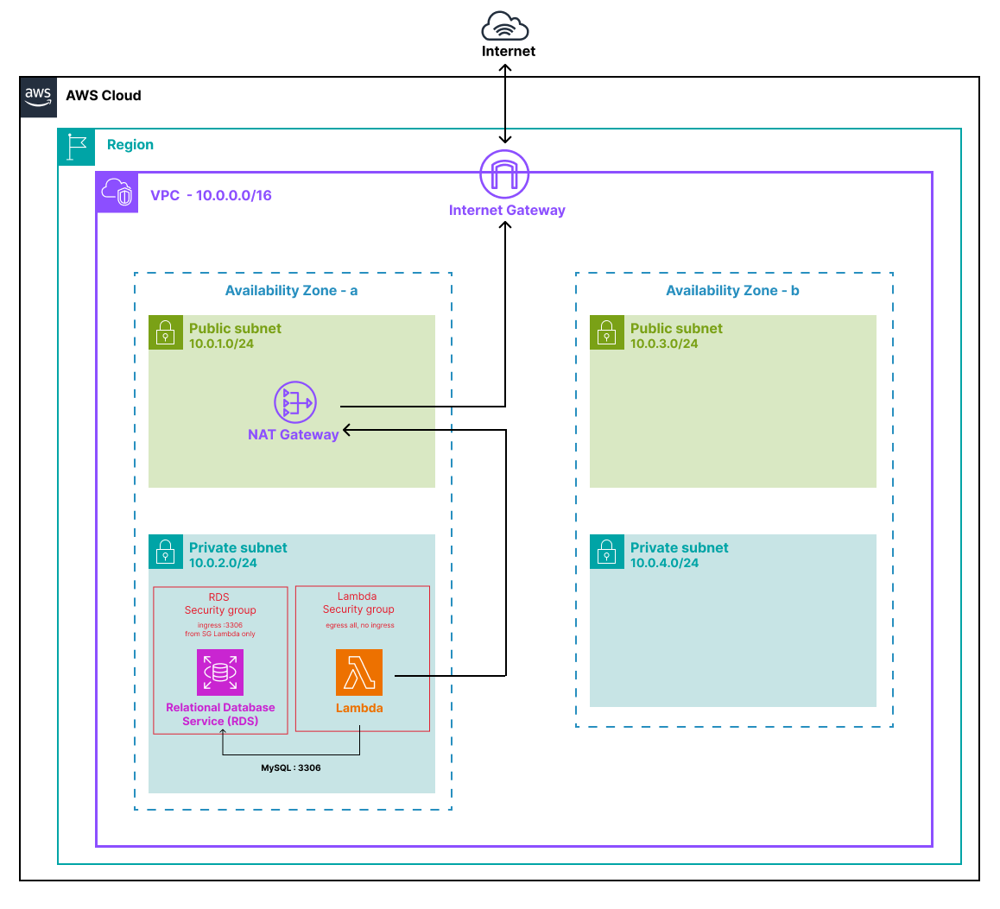

# lab-03-vpc-access

## Objective

Deploy a Lambda function inside a VPC so it can access private resources — the most common production pattern when Lambda needs to reach an RDS database or any internal service not exposed to the internet.
This lab wires together four layers: a VPC with public and private subnets, a NAT Gateway for outbound internet access, a MySQL RDS instance locked inside the private network, and a Lambda function that connects to it and runs a query.

---

## What this lab deploys

- **1 VPC** — `lab03-vpc`, CIDR `10.0.0.0/16`, DNS support and hostnames enabled
- **4 Subnets** — 2 public (AZ-a/b) and 2 private (AZ-a/b), each in a dedicated CIDR block
- **1 Internet Gateway** — attached to the VPC, used by the public route table
- **1 NAT Gateway** — placed in the public subnet AZ-a, with an Elastic IP; routes outbound internet traffic from private subnets
- **2 Route Tables** — public (0.0.0.0/0 → IGW) and private (0.0.0.0/0 → NAT)
- **2 Security Groups** — one for Lambda (unrestricted egress, no ingress), one for RDS (ingress on port 3306 from Lambda SG only)
- **1 RDS MySQL 8.0 instance** — `lab03-mysql`, `db.t3.micro`, deployed in the private subnet, never publicly accessible
- **1 DB Subnet Group** — spans both private subnets (AZ-a and AZ-b), required by AWS even for single-AZ deployments
- **1 Lambda Function** — `lab03-function`, Python 3.12, VPC-attached, connects to RDS and returns the MySQL server time
- **1 IAM Role** — attached to Lambda, with `AWSLambdaBasicExecutionRole` and `AWSLambdaVPCAccessExecutionRole`
- **1 CloudWatch Log Group** — `/aws/lambda/lab03-function`, retention 7 days

---

## What you learn

- **Why Lambda in a private subnet, not public** — a Lambda placed in a public subnet has no internet access: AWS never assigns a public IP to a Lambda ENI, so the Internet Gateway cannot route its outbound traffic. The only working pattern is private subnet + NAT Gateway — even though it feels counterintuitive
- **ENIs (Elastic Network Interfaces)** — when a Lambda is attached to a VPC, AWS creates network interfaces in the configured private subnets; these ENIs are visible in EC2 → Network Interfaces as `"AWS Lambda VPC ENI - <function-name>"`
- **VPC cold start history** — before 2020, a new ENI was created on every cold start, adding up to 15 seconds of latency; since then, AWS uses shared Hyperplane ENIs pre-provisioned at deploy time, bringing cold start overhead back to normal
- **DB Subnet Group and the 2-AZ requirement** — RDS is actually deployed in AZ-a only; the private subnet in AZ-b is empty in practice but required because AWS mandates at least 2 subnets in different AZs in the DB Subnet Group, even for single-AZ instances. If `multi_az = true` were enabled, RDS would place a standby replica in AZ-b automatically
- **Security Groups as source references** — the RDS security group references the Lambda security group ID as its ingress source, not a CIDR block; if the Lambda SG is deleted or changed, access is automatically revoked — more robust than a subnet-wide CIDR rule
- **Database connection management in Lambda** — opening a new TCP connection on every invocation adds latency and risks exhausting RDS `max_connections` under load; the production pattern is to store the connection in a global variable and reuse it across warm invocations; this lab uses a simplified version (open + close per call) appropriate for learning
- **`AWSLambdaVPCAccessExecutionRole`** — a frequently forgotten IAM policy; without it, Lambda cannot create the ENIs it needs to join the VPC and deployment silently fails

---

## Architecture



Lambda is attached to the private subnet. Outbound internet traffic (if needed) routes through the NAT Gateway in the public subnet. RDS is only reachable from within the VPC, exclusively from resources carrying the Lambda security group.

---

## Structure

```
lab-02-vpc-access/
├── README.md
├── script/
│   ├── handler.py                  # Lambda — connects to RDS and returns MySQL server time
│   ├── build.sh                    # pip install pymysql + copy handler into script/build/
│   └── vpc-access-terraform.sh     # terraform init + apply shortcut
└── terraform/
    ├── main.tf                     # VPC module call
    ├── rds.tf                      # Security Groups, DB Subnet Group, RDS instance
    ├── lambda.tf                   # IAM role, Lambda packaging, Lambda function
    ├── outputs.tf                  # RDS endpoint, NAT IP, invoke and logs commands
    ├── providers.tf                # AWS provider (~> 5.0), archive provider
    ├── variables.tf                # region, project_name, db credentials
    ├── terraform.tfvars.example    # template — copy to terraform.tfvars before deploying
    └── terraform.tfvars            # actual values — not committed (see .gitignore)
```

---

## Prerequisites

- [Terraform](https://developer.hashicorp.com/terraform/install) >= 1.3
- AWS CLI configured (`aws configure`)
- Python 3 + pip (for the Lambda build step)
- Permissions: `lambda:*`, `ec2:*`, `rds:*`, `iam:*`, `logs:*`

---

## Usage

### Step 1 — Build the Lambda package

`pymysql` is not included in the AWS Python runtime. The build script installs it locally alongside the handler before Terraform packages everything into a zip.

```bash
chmod +x script/build.sh
./script/build.sh
```

Verify that `script/build/` contains `handler.py` and the `pymysql*/` folders.

### Step 2 — Deploy

```bash
cp terraform/terraform.tfvars.example terraform/terraform.tfvars
# Edit terraform.tfvars and set a real db_password

bash script/vpc-access-terraform.sh
```

Terraform creates all resources in approximately **10–15 minutes** — RDS alone takes 8–10 minutes. Copy the outputs when the apply completes:

```bash
export FUNCTION_NAME="lab03-function"
```

### Step 3 — Verify in the AWS console

| Service | What to check |
|---|---|
| VPC → Your VPCs | `lab03-vpc` present, CIDR `10.0.0.0/16` |
| VPC → Subnets | 2 public subnets + 2 private subnets across AZ-a and AZ-b |
| VPC → NAT Gateways | Status `Available`, placed in public subnet AZ-a |
| VPC → Route Tables | Private table has route `0.0.0.0/0 → nat-xxx` |
| EC2 → Network Interfaces | Filter by `AWS Lambda VPC ENI` — Lambda ENIs visible in private subnets |
| VPC → Security Groups | `lab03-lambda-sg` (no ingress) and `lab03-rds-sg` (ingress 3306 from Lambda SG) |
| RDS → Databases | `lab03-mysql` status `Available`, `Publicly accessible: No` |
| Lambda → Functions | `lab03-function` present, VPC config shows private subnets and Lambda SG |
| Lambda → Configuration → Environment variables | `DB_HOST`, `DB_PORT`, `DB_NAME`, `DB_USER`, `DB_PASSWORD` present |

### Step 4 — Test

```bash
# Invoke the Lambda
aws lambda invoke \
  --function-name lab03-function \
  --region eu-west-3 \
  /tmp/response.json && cat /tmp/response.json
```

Expected response:

```json
{
  "statusCode": 200,
  "body": "{\"message\": \"RDS connection successful\", \"mysql_time\": \"2026-05-09 14:32:11\"}"
}
```

If you get a `500`, the `detail` field in the body tells you exactly why — common causes:

| Error message | Cause |
|---|---|
| `Can't connect to MySQL server` | RDS not yet `Available` — wait 2–3 minutes and retry |
| `Access denied for user` | Wrong `db_username` or `db_password` in `terraform.tfvars` |
| Timeout with no message | Security Group misconfiguration — traffic never reaches RDS |

### Step 5 — Check the logs

```bash
aws logs tail /aws/lambda/lab03-function --follow --region eu-west-3
```

Or in the console: **CloudWatch → Log groups → `/aws/lambda/lab03-function`**.

### Step 6 — Experiment

**Break the Security Group** — in the console, remove the inbound rule on port 3306 from `lab03-rds-sg`, then invoke Lambda again. You get a timeout: the TCP connection is blocked at the network level before MySQL even responds. Re-add the rule afterwards.

**Confirm RDS is private** — try connecting to the RDS endpoint from your local machine with any MySQL client. It will fail: the endpoint does not respond from outside the VPC.

---

## Key concepts

### Why private subnet and not public?

The counter-intuitive rule: **a Lambda in a public subnet has no internet access**.

AWS attaches Lambda to a VPC via ENIs. These ENIs never receive a public IP, even if the subnet has `map_public_ip_on_launch = true`. The Internet Gateway only routes traffic to resources with an explicit public IP — not to Lambda ENIs.

The result: a Lambda in a public subnet is isolated in both directions. It cannot reach the internet, and it cannot properly reach private VPC resources either. The only configuration that works:

```
Lambda (private subnet) → NAT Gateway (public subnet) → Internet Gateway → Internet
Lambda (private subnet) → RDS (private subnet)   [intra-VPC, no NAT needed]
```

### ENIs and the cold start history

Lambda does not run inside your VPC. It runs on AWS-managed infrastructure and communicates with your VPC through ENIs created in your private subnets.

**Before 2020:** a new ENI was created on every cold start — adding up to 10–15 seconds of latency. VPC attachment was strongly discouraged.

**Since 2020 (Hyperplane ENIs):** ENIs are created once at deploy time and shared across function instances. Cold start overhead is back to normal (~100–500ms).

You can see these ENIs in **EC2 → Network Interfaces**, filtered by description `AWS Lambda VPC ENI`.

### The DB Subnet Group and the 2-AZ constraint

RDS is deployed in a single AZ (AZ-a in this lab). The private subnet in AZ-b is **empty** — it exists only to satisfy an AWS requirement: a DB Subnet Group must reference at least 2 subnets in 2 different Availability Zones, even for single-AZ instances.

If `multi_az = true` were set on the RDS instance, AWS would automatically provision a standby replica in AZ-b and handle failover transparently. That is not the case here.

### Security Groups as source references

The RDS security group does not reference a CIDR block — it references the Lambda security group ID directly:

```hcl
ingress {
  from_port       = 3306
  to_port         = 3306
  protocol        = "tcp"
  security_groups = [aws_security_group.lambda.id]
}
```

This means any resource in the same subnet that does *not* carry the Lambda SG cannot reach RDS — more precise than a subnet-wide CIDR rule, and automatically enforced if the Lambda SG is ever removed.

### Database connections in Lambda

This lab opens and closes a connection on every invocation — simple and correct for learning. In production, the connection is stored in a global variable outside the handler so warm invocations reuse it without the TCP/TLS handshake overhead:

```python
_connection = None

def get_connection():
    global _connection
    if _connection is None:
        _connection = pymysql.connect(...)
    else:
        _connection.ping(reconnect=True)
    return _connection
```

Under high concurrency, every parallel Lambda instance holds its own persistent connection, which can exhaust RDS `max_connections`. The solution for production is **RDS Proxy**, which pools connections between Lambda and RDS.

---

## Cleanup

```bash
cd terraform/
terraform destroy
```

Verify in the console afterwards:

- **RDS → Databases** — instance gone
- **VPC → NAT Gateways** — status `Deleted` (this is the hourly-billed resource — confirm it)
- **EC2 → Elastic IPs** — the NAT EIP has been released (unattached EIPs are billed)
- **VPC → Your VPCs** — `lab03-vpc` deleted

If `terraform destroy` fails partway through (common with RDS), run it again — Terraform resumes from where it stopped.

---

## Cost

This lab is **not free** — destroy it after use.

| Resource | Cost |
|---|---|
| RDS `db.t3.micro` | ~$0.02 / hour |
| NAT Gateway | ~$0.045 / hour + $0.045 / GB processed |
| Lambda, CloudWatch | Within free tier |

**A few hours of testing costs less than $1.** The NAT Gateway is the main expense — confirm it is deleted after `terraform destroy`.