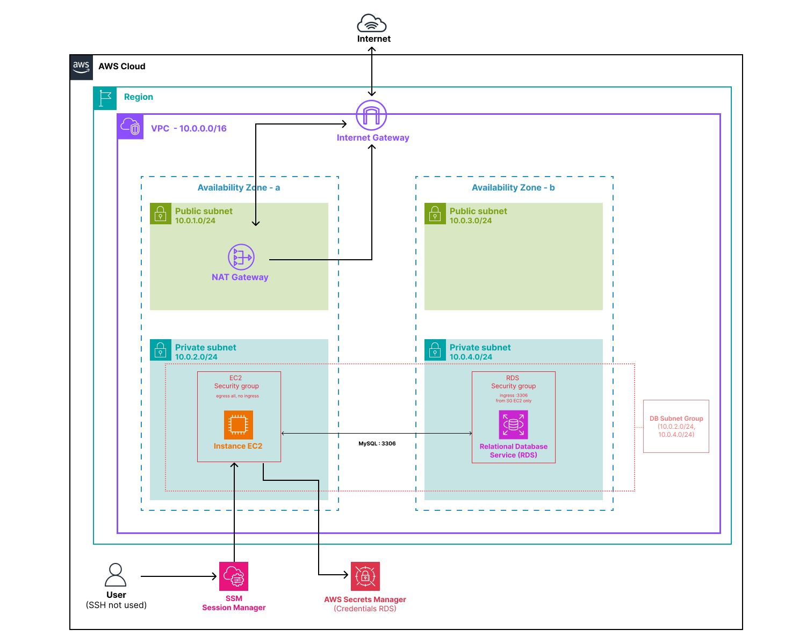

# lab-01-private-instance

## Objective

Deploy a relational database correctly — in a private subnet, unreachable from the internet, accessible only from authorized resources. This is the minimum acceptable architecture for production.

---

## What this lab deploys

- **1 VPC** — with 2 public subnets (AZ-a, AZ-b) and 2 private subnets (AZ-a, AZ-b), NAT Gateway enabled for SSM connectivity
- **1 EC2 Instance** — `lab-01-private-instance`, Ubuntu 22.04 t3.micro, no public IP, SSM access only
- **1 RDS Instance** — MySQL 8.0, db.t3.micro, 20 GB gp2, single-AZ, no public IP, credentials managed by AWS Secrets Manager
- **1 DB Subnet Group** — spans both private subnets across 2 AZs (required by AWS even for single-AZ instances)
- **2 Security Groups** — EC2 (egress only) and RDS (port 3306 from EC2 security group only)
- **1 IAM Role** — least-privilege: SSM Session Manager access + read permission on the RDS-managed secret
- **1 Secret** — auto-generated by AWS in Secrets Manager via `manage_master_user_password = true`

---

## What you learn

- **Why RDS has no public IP in a correct architecture** — the RDS endpoint is a DNS name that resolves to a private IP only; even with a permissive security group, the database would be unreachable from the internet
- **The DB Subnet Group and the 2-AZ requirement** — AWS enforces at least 2 availability zones even for single-AZ instances, to allow future failover to Multi-AZ without reconfiguration
- **RDS credential management with Secrets Manager** — `manage_master_user_password = true` delegates password generation, storage, and rotation to AWS; no password is ever hardcoded or committed
- **Security group source referencing** — the RDS ingress rule references the EC2 security group ID, not a CIDR block; the rule follows the security group, not an IP address
- **SSM Session Manager vs SSH** — no port 22, no key pair, no public IP; access goes through an encrypted AWS API tunnel with a full CloudTrail audit trail
- **Writer vs reader endpoints** *(opening toward advanced architectures)* — the writer endpoint handles reads and writes; a reader endpoint becomes available with Read Replicas or Aurora for horizontal read scaling

---

## Architecture



```
Internet
   │
   ✗  (no direct access to RDS or EC2)
   │
┌──┴─────────────────────────────────────────────────┐
│  VPC  10.0.0.0/16                                  │
│                                                    │
│  ┌──────────────────────┐   Port 3306              │
│  │  EC2 — private AZ-a  │ ──────────────► RDS      │
│  │  Ubuntu 22.04        │   SG source    MySQL 8.0 │
│  │  SSM only            │                AZ-b      │
│  └──────────┬───────────┘                          │
│             │ SSM Session Manager (HTTPS 443)      │
└─────────────┼──────────────────────────────────────┘
              │
           AWS SSM ◄── you (aws ssm start-session)
```

---

## Structure

```
lab-01-private-instance/
├── README.md
├── docs/
│   └── diagram-RDS-lab01-private-instance.png
├── script/
│   ├── user_data.sh                    # Installs MySQL client, seeds README and lab.sql on EC2
│   └── private-instance-terraform.sh  # terraform init + apply shortcut
└── terraform/
    ├── ec2.tf                          # EC2 instance, Ubuntu AMI, user_data injection
    ├── iam.tf                          # EC2 role, SSM policy, Secrets Manager read policy
    ├── main.tf                         # VPC module call
    ├── outputs.tf                      # RDS endpoint, EC2 instance ID, secret ARN
    ├── providers.tf                    # AWS provider (~> 5.0)
    ├── rds.tf                          # DB Subnet Group, RDS MySQL instance
    ├── security_group.tf               # EC2 SG (egress only) and RDS SG (port 3306 from EC2)
    ├── terraform.tfvars                # Your values — git-ignored
    ├── terraform.tfvars.example        # Committed template
    └── variables.tf                    # aws_region, project_name, db_name, db_username
```

---

## Prerequisites

- [Terraform](https://developer.hashicorp.com/terraform/install) >= 1.6
- AWS CLI configured (`aws configure`)
- [Session Manager plugin](https://docs.aws.amazon.com/systems-manager/latest/userguide/session-manager-working-with-install-plugin.html) for the AWS CLI
- Permissions: `ec2:*`, `rds:*`, `iam:*`, `secretsmanager:*`, `ssm:*`

---

## Usage

### Step 1 — Configure

```bash
cp terraform/terraform.tfvars.example terraform/terraform.tfvars
# Edit terraform.tfvars — set project_name, db_name, db_username
```

### Step 2 — Deploy

```bash
bash script/private-instance-terraform.sh
```

Provisioning takes **10–15 minutes** — RDS is slow to initialize. Note the three outputs at the end:

```
rds_endpoint     = "lab01-mysql.xxxxxx.eu-west-3.rds.amazonaws.com"
ec2_instance_id  = "i-0abc123def456789"
rds_secret_arn   = "arn:aws:secretsmanager:eu-west-3:..."
```

### Step 3 — Explore the console before testing

**VPC → Subnets** — confirm 4 subnets are present (2 public, 2 private). EC2 and RDS are in private subnets.

**EC2 → Instances** — the instance has no public IPv4 address. The *Public IPv4 address* field is empty.

**RDS → Databases → your instance**
- *Publicly accessible*: **No**
- *Endpoint*: a DNS name, not an IP address
- *DB Subnet Group*: lists both private subnets

**Secrets Manager** — open the secret from `rds_secret_arn`. Click *Retrieve secret value* — you can see `username`, `password`, `host`, `port`, `dbname` in clear text. This is what `connect-rds.sh` retrieves automatically.

**Security Groups**
- EC2 SG: no ingress rules, one egress rule `0.0.0.0/0`
- RDS SG: one ingress rule on port 3306, source = EC2 SG ID (not a CIDR)

### Step 4 — Connect to EC2 via SSM

```bash
aws ssm start-session \
  --target i-0abc123def456789 \
  --region eu-west-3
```

Check that user data ran successfully:

```bash
cat /var/log/user-data.log
# Last line should be: === Fin user data ===

ls /home/ubuntu/
# → README.md  connect-rds.sh  lab.sql
```

### Step 5 — Verify the RDS endpoint is private

```bash
# Must resolve to a private IP (10.x.x.x) — never a public one
nslookup lab01-mysql.xxxxxx.eu-west-3.rds.amazonaws.com
```

This confirms that the RDS endpoint DNS resolves to an IP inside your VPC only.

### Step 6 — Connect to RDS and run the lab

**Option A — automatic (recommended to start):**

```bash
./connect-rds.sh
```

The script retrieves the password from Secrets Manager and opens the MySQL session directly.

**Option B — manual (recommended to understand what's happening):**

```bash
# Retrieve the secret
aws secretsmanager get-secret-value \
  --secret-id "arn:aws:secretsmanager:eu-west-3:..." \
  --region eu-west-3 \
  --query SecretString \
  --output text

# Connect (paste the password when prompted)
mysql -h lab01-mysql.xxxxxx.eu-west-3.rds.amazonaws.com -u admin -p
```

Once in MySQL:

```sql
USE labdb;

-- Run the lab script
source /home/ubuntu/lab.sql

-- Explore
SHOW TABLES;
DESCRIBE users;
SELECT COUNT(*) FROM users;

-- Confirm you're on the right server
SHOW VARIABLES LIKE 'hostname';

EXIT;
```

### Step 7 — Cleanup

Exit the SSM session first (`exit`), then from your machine:

```bash
cd terraform/
terraform destroy
```

Confirm with `yes`. Takes 5–10 minutes.

**Verify in the console after destroy:**
- EC2 → Instances: status *terminated*
- RDS → Databases: empty
- VPC: the lab VPC is gone
- Secrets Manager: the secret may remain in *scheduled for deletion* state for a few days — this is expected AWS behavior

---

## Verification checklist

| Where | What to verify |
|---|---|
| VPC → Subnets | 4 subnets present (2 public, 2 private, 2 AZs) |
| EC2 → Instances | No public IPv4 address |
| RDS → your instance | *Publicly accessible*: No |
| RDS → DB Subnet Group | Both private subnets listed |
| Secrets Manager | Secret type: RDS managed, all fields present |
| Security Groups | RDS ingress source = EC2 SG ID, not a CIDR |
| SSM session | `/var/log/user-data.log` ends with `=== Fin user data ===` |
| `nslookup` on RDS endpoint | Returns a `10.x.x.x` address |
| MySQL session | `SHOW VARIABLES LIKE 'hostname'` returns an RDS identifier |

---

## Key concepts

### Why no public IP on RDS?

`publicly_accessible = false` means the RDS endpoint DNS resolves to a private IP only. There is no route from the internet to that IP — even an open security group would not help. This is what a correct architecture looks like.

### DB Subnet Group and the 2-AZ requirement

AWS enforces at least 2 availability zones in a DB Subnet Group, even for a single-AZ instance. The reason: AWS needs flexibility during maintenance windows, and having 2 AZs already configured means you can enable Multi-AZ later with zero reconfiguration.

This is one of the most common reasons first deployments fail — a single subnet causes a `DBSubnetGroupDoesNotCoverEnoughAZs` error.

### Credentials with `manage_master_user_password`

```hcl
manage_master_user_password = true
```

AWS generates a strong random password, stores it in Secrets Manager, and handles rotation automatically. No password is ever written in code, in a variable, or in a `.tfvars` file. The EC2 instance retrieves it at runtime via its IAM role — least privilege in action.

### Security group source referencing

```hcl
ingress {
  from_port       = 3306
  to_port         = 3306
  protocol        = "tcp"
  security_groups = [aws_security_group.ec2.id]
}
```

The rule references a security group ID, not a CIDR block. This means it applies to any resource that belongs to that security group, regardless of its IP address — more robust and more explicit than IP-based rules.

---

## Cost

| Resource | Free tier |
|---|---|
| RDS db.t3.micro | 750 h/month for 12 months, then ~$0.02/h |
| EC2 t3.micro | 750 h/month for 12 months |
| NAT Gateway | ~$0.045/h + data — **not free tier** |
| Secrets Manager | $0.40/secret/month |

> **The NAT Gateway is the main cost driver** — approximately $1/day if left running. Always destroy after the lab.