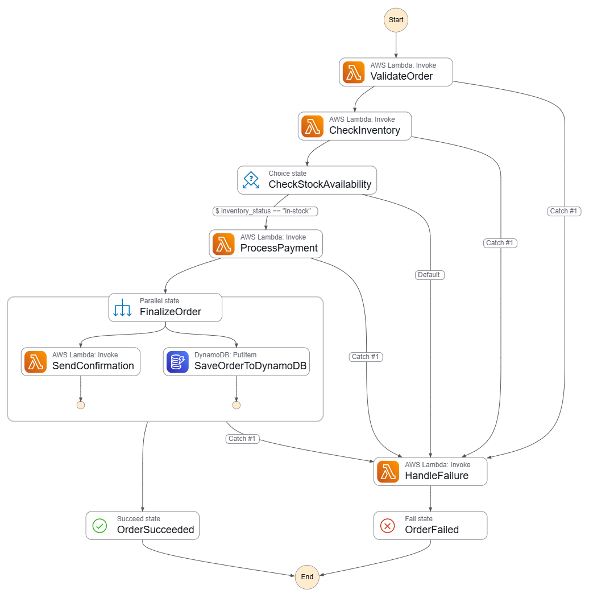

# lab-01 — Lambda Orchestration with Step Functions

 Orchestrate multiple Lambdas into a structured workflow with error handling, retries, and conditional branching.  
 Understand why Step Functions exists and what it solves compared to Lambdas calling each other directly.

---

## What This Lab Covers

- **5 Lambda functions** — each does one thing, with no knowledge of the workflow around it
- **1 Step Functions Standard state machine** — holds all orchestration logic: retries, branches, error handling
- **1 Choice state** — branches on inventory result: `in-stock` → payment, `out-of-stock` → failure handler
- **Retry with exponential backoff** — 3 attempts on payment, intervals 2s → 4s → 8s, defined once in ASL
- **Catch** — if all retries fail, redirects to the failure handler
- **Parallel state** — sends confirmation (SNS) and persists the order (DynamoDB) simultaneously
- **2 SNS topics** — customer confirmation + ops alert on failure
- **1 DynamoDB table** — order records written only on successful completion

---

## State Machine Architecture





The orchestration logic is defined in the Step Functions state machine rather than inside the Lambda code itself, making the workflow easier to visualize, debug, and maintain.

---

## Structure

```
lab-01-orchestration-lambda/
├── terraform/
│   ├── main.tf            # Provider, locals
│   ├── variables.tf
│   ├── lambdas.tf         # Lambda functions + CloudWatch log groups
│   ├── step_functions.tf  # Full ASL state machine definition
│   ├── iam.tf             # Roles for Lambda and Step Functions
│   ├── sns.tf             # Confirmation + alert topics
│   ├── dynamodb.tf        # Orders table (on-demand, with TTL)
│   └── outputs.tf         # ARNs, console URL
├── lambdas/
│   ├── validate-order/    # Field validation
│   ├── check-inventory/   # Stock check (deterministic + random)
│   ├── process-payment/   # Payment with intentional failures
│   ├── send-confirmation/ # SNS publish (used in Parallel branch)
│   └── handle-failure/    # Failure convergence point, SNS alert
└── scripts/
    └── run-tests.sh       # 5 CLI test scenarios
```

---

## Prerequisites

- Terraform >= 1.6
- AWS CLI configured (`aws configure`)
- jq (`brew install jq` / `apt install jq`)

---

## Full Lab Walkthrough

### Step 1 — Deploy

```bash
cd terraform/
terraform init
terraform plan
terraform apply
```

Note the outputs:
```
state_machine_arn = "arn:aws:states:eu-west-1:..."
console_url       = "https://console.aws.amazon.com/states/..."
```

**Console checks before running anything:**
- **Step Functions** → open the `console_url` output → click **Definition** → verify the visual graph renders with all states connected
- **Lambda** → confirm 5 `lab01-*` functions exist → open `lab01-process-payment` → **Configuration → Environment variables** → `CONFIRMATION_TOPIC_ARN` and `ALERT_TOPIC_ARN` are injected
- **DynamoDB** → table `lab01-orders` exists, **Items** tab is empty — expected

---

### Step 2 — Run the test scenarios

```bash
cd ..
chmod +x scripts/run-tests.sh
./scripts/run-tests.sh
```

Or trigger a single execution manually:

```bash
STATE_MACHINE_ARN=$(terraform -chdir=terraform output -raw state_machine_arn)

aws stepfunctions start-execution \
  --state-machine-arn "$STATE_MACHINE_ARN" \
  --name "test-$(date +%s)" \
  --input '{"order_id":"ORD-001","customer_id":"CUST-42","product_id":"PROD-001","quantity":2,"amount":99.99}'
```

---

### Step 3 — Observe executions in the console

This is where Step Functions pays off. For each execution:

**Step Functions → your state machine → Executions tab** → click any execution.

| Scenario | What to look for | Expected Result |
|----------|-----------------|-----------------|
| Happy path (`PROD-001`, amount 99.99) | All states green; Parallel splits into 2 simultaneous branches | ✅ SUCCEEDED |
| Out-of-stock (`PROD-OUT`) | `CheckStockAvailability` (Choice) arrows directly to `HandleFailure` | ❌ FAILED |
| Amount ≥ 1000 | `ProcessPayment` retries 3 times (watch the Events tab timestamps: +2s, +4s, +8s), then Catch fires | ❌ FAILED |
| Amount 750 | May retry once or twice before succeeding — or fail; run multiple times to see both | ✅/❌ Variable |
| Missing fields | `ValidateOrder` fails immediately, no retry, straight to `HandleFailure` | ❌ FAILED |

**Click any state in the graph:**
- **Input / Output tabs** — see exactly what data flowed through
- **Exception tab** — exact error message on failure
- **Events tab** (bottom) — full timeline with timestamps; the retry intervals are visible here

---

### Step 4 — Verify side effects

**DynamoDB** → `lab01-orders` → **Explore items**
- Successful orders appear with `status: COMPLETED`
- Failed orders are absent — the DynamoDB write is inside the Parallel state, after payment

**CloudWatch Logs**
- `/aws/lambda/lab01-handle-failure` — structured JSON logs for every failure
- `/aws/lambda/lab01-process-payment` — retry attempts visible with their error type
- `/aws/states/lab01-order-pipeline` — full state machine audit log, input/output per state

**Run scenario 4 multiple times** to observe the retry behavior across different outcomes:
```bash
for i in 1 2 3 4 5; do
  aws stepfunctions start-execution \
    --state-machine-arn "$STATE_MACHINE_ARN" \
    --name "flaky-$i-$(date +%s)" \
    --input "{\"order_id\":\"ORD-$i\",\"customer_id\":\"CUST-77\",\"product_id\":\"PROD-002\",\"quantity\":1,\"amount\":750}"
  sleep 1
done
```

---

### Step 5 — Cleanup

```bash
cd terraform/
terraform destroy
```

Everything is Terraform-managed — no manual cleanup needed.

**Confirm in the console:** no `lab01-*` Lambda functions, no `lab01-order-pipeline` state machine, no `lab01-orders` DynamoDB table.

---

## Lambda Behavior Reference

### check-inventory
- `PROD-001`, `PROD-002`, `PROD-999` → always **in-stock**
- `PROD-OUT`, `PROD-000` → always **out-of-stock**
- All others → random (70% in-stock)

### process-payment
- `amount < 500` → always **succeeds**
- `500 ≤ amount < 1000` → **60% transient failure** — tests retry behavior
- `amount ≥ 1000` → always **declined** — exhausts all retries, triggers Catch

---

## Key Concepts

### What Step Functions solves

Without Step Functions, each Lambda would need to know what to call next, how many times to retry, and where to route errors. That logic scatters across five functions and becomes impossible to follow. The state machine centralizes everything: the Lambdas are plain functions with no workflow awareness, and the entire execution path — including retries and branches — is visible as a graph.

### Retry and Catch live in the ASL, not in Lambda code

The retry policy for `ProcessPayment` is defined once in `step_functions.tf`. The Lambda itself just raises an exception. Step Functions handles the wait, the backoff, and the eventual Catch redirect. Clean separation of responsibilities.

### DynamoDB without a Lambda

The `SaveOrderToDynamoDB` step in the Parallel state uses a direct SDK integration (`arn:aws:states:::dynamodb:putItem`) — no Lambda wrapper needed. Step Functions can call ~200 AWS services natively. Worth noticing as a pattern.

---

## Cost

| Resource | Cost |
|----------|------|
| Step Functions Standard | $0.025 / 1,000 state transitions |
| ~20 executions × ~6 transitions | **< $0.01** |
| Lambda, DynamoDB, SNS | Free tier / negligible |
| **Total** | **essentially free** |