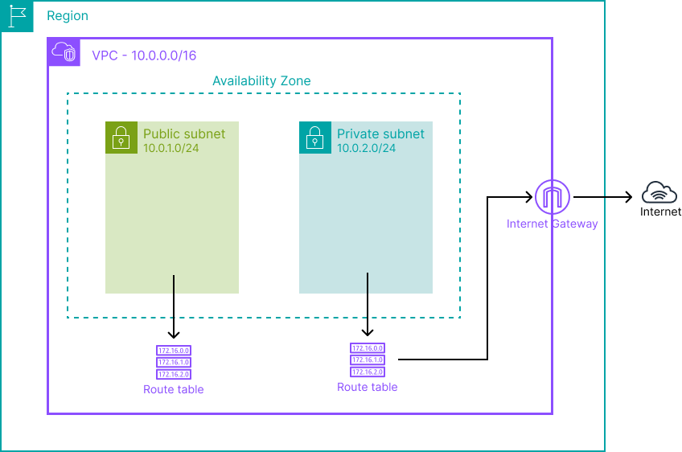

# lab-01-vpc-standard

## Objective

Understand how AWS networking is structured at its foundation.

This lab covers the creation of a VPC, public and private subnets, an Internet Gateway, and route tables — the building blocks reused in almost every lab that follows.

---

## What this lab deploys

- **1 VPC** : `10.0.0.0/16`
- **1 Public subnet** : `10.0.1.0/24` — associated with a route table that has a route to the IGW
- **1 Private subnet** : `10.0.2.0/24` — associated with a route table with no outbound route
- **1 Internet Gateway** : attached to the VPC
- **1 Public route table** : route `0.0.0.0/0 → IGW`, associated with the public subnet
- **1 Private route table** : local route only, associated with the private subnet

---

## What you learn

- The difference between a public and private subnet — it's the **route table** that makes the difference, not a magic parameter on the subnet itself
- The role of the Internet Gateway
- Why a resource in the private subnet cannot reach the internet without a NAT Gateway — in a real project, one would be added
- Basic CIDR logic

---

## Architecture



The public subnet routes outbound traffic through the Internet Gateway. The private subnet has no outbound route — any resource inside it is unreachable from the internet and cannot reach it.

---

## Structure

```
lab-01-vpc-standard/
├── terraform/
│   ├── main.tf           # VPC, subnets, IGW, route tables, associations
│   ├── variables.tf      # Region
│   ├── outputs.tf        # VPC ID, subnet IDs
│   ├── providers.tf      # AWS provider (~> 5.0)
├── script/
│   └── vpc-standard-terraform.sh  # Init + apply
├── docs/
│   └── diagram.png
└── README.md
```

---

## Prerequisites

- [Terraform](https://developer.hashicorp.com/terraform/install) >= 1.0
- AWS CLI configured (`aws configure`)
- IAM permissions to create VPC resources

---

## Usage

### Option 1 — Via the script

```bash
chmod +x script/vpc-standard-terraform.sh
./script/vpc-standard-terraform.sh
```

### Option 2 — Manually

```bash
cd terraform/
terraform init
terraform plan
terraform apply
```

---

## Verification

After `terraform apply`, check in the AWS console:

- The VPC appears with CIDR `10.0.0.0/16`
- Both subnets are attached to the VPC
- The IGW status is **attached** (not detached)
- The public route table has a route `0.0.0.0/0 → igw-xxx`
- The private route table only has the local route `10.0.0.0/16 → local`
- Subnet ↔ route table associations are correct

---

## A note on NACLs

AWS provides two layers of network access control:

- **Security Groups** — stateful, attached to a resource (EC2, RDS…). If you allow inbound traffic, the response is automatically allowed outbound.
- **NACLs (Network ACLs)** — stateless, attached to a subnet. Inbound and outbound rules are evaluated independently. They act as a coarse subnet-level firewall.

In most architectures, Security Groups alone are sufficient. NACLs are typically used for an extra layer of defense at the subnet boundary (e.g. explicitly blocking a CIDR range). This lab doesn't create a dedicated NACL — the default one is applied automatically by AWS and allows all traffic.

---

## Cleanup

```bash
cd terraform/
terraform destroy
```

---

## Cost

**$0** — a VPC and its associated resources (subnets, route tables, IGW) have no cost on their own.