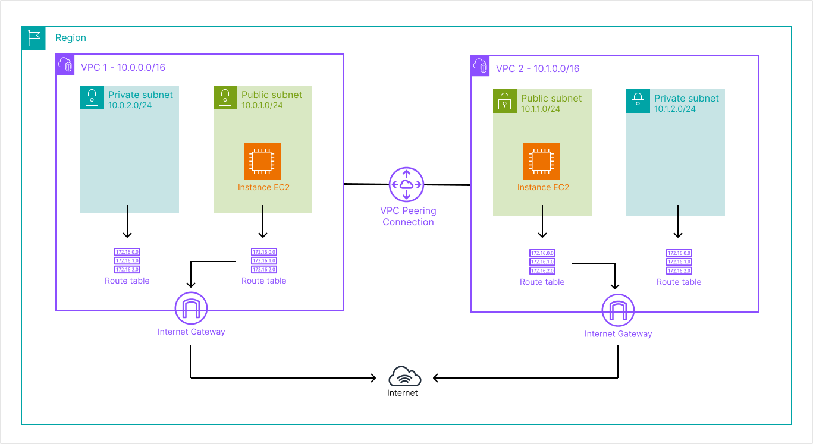

# lab-03-vpc-peering

## Objective

Understand how to make two isolated VPCs communicate with each other — a pattern used in every multi-environment or multi-team AWS architecture.

---

## What this lab deploys

- **2 VPCs** — `lab03-vpc1` (`10.0.0.0/16`) and `lab03-vpc2` (`10.1.0.0/16`), each with a public and private subnet
- **1 VPC Peering connection** — bidirectional link between the two VPCs
- **Cross routes** — VPC1's route table routes `10.1.0.0/16` via the peering, and vice versa
- **Security Groups** — SSH and web rules per VPC, plus dedicated ICMP rules to allow ping between VPCs
- **2 EC2 instances** — one per VPC, used to validate connectivity end-to-end

---

## What you learn

- VPC peering is **not transitive** — if VPC-A peers with VPC-B and VPC-B peers with VPC-C, A cannot reach C
- Routes are **not created automatically** after peering — this is the most common mistake
- CIDR blocks between peered VPCs must not overlap
- Ping requires ICMP to be explicitly allowed in Security Groups — it is blocked by default like any other protocol

---

## Architecture



Each VPC has its own Internet Gateway, subnets, and route tables. The peering connection is not a gateway — it is a direct private link between the two VPCs. Traffic between them never leaves the AWS network.

---

## Structure
```
lab-03-vpc-peering/
├── terraform/
│   ├── main.tf                        # VPCs, SGs, peering, routes, EC2 instances
│   ├── variables.tf                   # Region, your IP
│   ├── outputs.tf                     # Instance public IPs, VPC2 private IP, key name
│   ├── providers.tf                   # AWS provider (~> 5.0)
│   ├── terraform.tfvars               # Your actual IP (not committed)
│   └── terraform.tfvars.example       # Template to copy
├── script/
│   └── vpc-peering-terraform.sh       # Init + apply
└── README.md
```

---

## Prerequisites

- [Terraform](https://developer.hashicorp.com/terraform/install) >= 1.0
- AWS CLI configured (`aws configure`)
- IAM permissions to create VPC, EC2, and Security Group resources
- An SSH key pair on your machine (`~/.ssh/id_rsa.pub`)

If you don't have an SSH key yet:
```bash
ssh-keygen -t rsa -b 4096
```

---

## Usage

### Configuration

Copy the example file and fill in your public IP:
```bash
cp terraform/terraform.tfvars.example terraform/terraform.tfvars
```

Get your public IP:
```bash
curl -4 ifconfig.me
```

Then set it in `terraform.tfvars`:
```
my_ip = "82.123.45.67/32"
```

### Option 1 — Via the script
```bash
chmod +x script/vpc-peering-terraform.sh
./script/vpc-peering-terraform.sh
```

### Option 2 — Manually
```bash
cd terraform/
terraform init
terraform plan
terraform apply
```

---

## Verification

After `terraform apply`, Terraform outputs the values you need:
```
ec2_vpc1_public_ip  = "15.188.x.x"
ec2_vpc2_public_ip  = "35.180.x.x"
ec2_vpc2_private_ip = "10.1.1.x"
key_name            = "lab03-key"
```

### Step 1 — Connect to the instance in VPC1
```bash
ssh -i ~/.ssh/id_rsa ubuntu@<ec2_vpc1_public_ip>
```

### Step 2 — Ping the instance in VPC2

From inside the VPC1 instance:
```bash
ping <ec2_vpc2_private_ip>
```

Expected result: ping replies — the peering connection, cross routes, and Security Groups are all correctly configured.

### Step 3 — Optional: test at the application layer

Install nginx on the VPC2 instance first:
```bash
ssh -i ~/.ssh/id_rsa ubuntu@<ec2_vpc2_public_ip>
sudo apt update && sudo apt install nginx -y
```

Then from the VPC1 instance:
```bash
curl http://<ec2_vpc2_private_ip>
```

Expected result: the nginx default page HTML is returned.

---

## Note on peering and transitivity

VPC peering is a direct, private link between exactly two VPCs. It is not transitive:

```
VPC-A <──peering──> VPC-B <──peering──> VPC-C
```

In this setup, VPC-A cannot reach VPC-C. If you need full mesh connectivity across many VPCs, the correct solution is AWS Transit Gateway — covered in a later lab.

---

## Cleanup
```bash
cd terraform/
terraform destroy
```

Both VPCs and all associated resources are destroyed. Neither VPC is shared with other labs.

---

## Cost

**~$0.01** for the two EC2 instances if destroyed shortly after testing. The VPC peering connection itself has no hourly cost — you are only billed for data transfer across the peering link, which is negligible for ping tests.